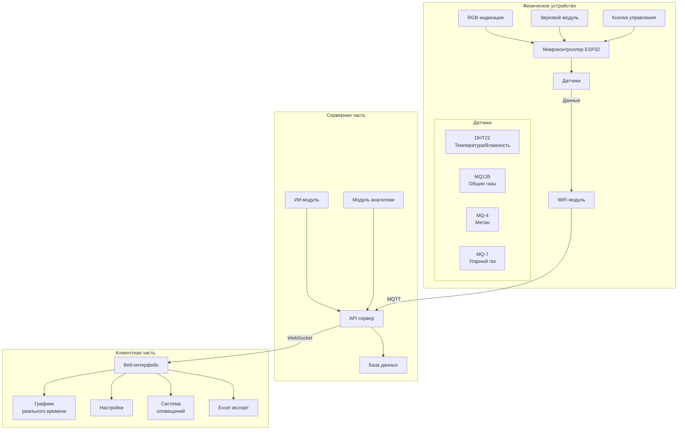

## Слайд 5: Архитектура системы
### КОМПОНЕНТЫ СИСТЕМЫ AIR PRO

### Описание компонентов:

#### 1. Физическое устройство
- **Микроконтроллер ESP32**
  - Управление всеми датчиками
  - Обработка данных
  - WiFi подключение
- **Набор датчиков**
  - DHT22: температура и влажность
  - MQ135: общие загрязняющие газы
  - MQ-4: метан
  - MQ-7: угарный газ
- **Система индикации**
  - RGB светодиод для визуальной индикации
  - Звуковой модуль для оповещений
  - Кнопка управления режимами

#### 2. Серверная часть
- **API сервер**
  - Прием данных от устройств
  - Обработка запросов
  - Управление устройствами
- **База данных**
  - Хранение исторических данных
  - Настройки пользователей
  - Конфигурации устройств
- **ИИ модуль**
  - Анализ данных
  - Генерация рекомендаций
  - Прогнозирование
- **Модуль аналитики**
  - Статистическая обработка
  - Формирование отчетов
  - Расчет трендов

#### 3. Клиентская часть
- **Веб-интерфейс**
  - Мониторинг в реальном времени
  - Управление настройками
  - Просмотр статистики
- **Дополнительные функции**
  - Графики и диаграммы
  - Система оповещений
  - Экспорт данных в Excel

### Взаимодействие компонентов:
1. Устройство собирает данные с датчиков
2. Данные передаются на сервер по MQTT протоколу
3. Сервер обрабатывает и сохраняет данные
4. ИИ анализирует данные и генерирует рекомендации
5. Веб-интерфейс получает обновления через WebSocket
6. Пользователь получает уведомления и управляет системой 